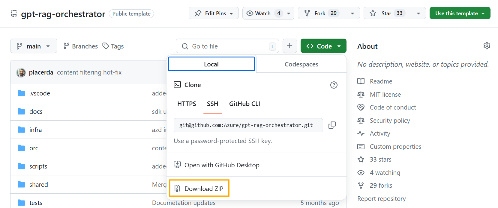

# Extending application components

Azd provisions the infrastructure and deploys the components. To meet specific needs, you can customize the code, such as updating the [bot description](https://github.com/swo-cesar-lopez/swo-gpt-rag-orchestrator/blob/main/orc/bot_description.prompt) in the orchestrator to better define the bot's scope.

This accelerator repositories are public, here are some options for extending its code in your projects: 

- **Forking the GitHub repository**: Choose this option if you want to contribute to the original project or keep your version connected. If you fork into a private GitHub repository, you can’t submit pull requests back unless you make your fork public or create a public branch.

- **Using as a GitHub Template**: Select this option if you want to copy repo code in a new, independent GitHUb repository. This lets you start fresh with a private repository, without linking it to the original.

- **Download the repo code then work on it locally**: If you prefer to work offline or in a local environment, you can download the repository code to your machine and customize it as needed before deployment.

- **Download the repo code then create a repo in other tools like Azure DevOps**: If you want to use a different version control system, you can download the repository code and then create a new repository in tools like Azure DevOps to manage your project.

That said, if you want to manually deploy and customize the components, you can follow the deployment instructions for each component, as described in the following sections.

> [!NOTE]
> To deploy, you will only need the Contributor role in the resource group where the solution's resources are located.

## **1) Data Ingestion Application**

Fork, copy or download the original [Data ingestion](https://github.com/swo-cesar-lopez/swo-gpt-rag-ingestion) repo to create your own data ingestion code then follow the steps in its **What if I want to redeploy just the ingestion component?** section to learn how to redeploy the component.

If you want to run the component locally, which is interesting for testing your modifications before deploying, check out the **Running Locally with VS Code** section in the component's repository.

## **2) Orchestrator Application**

Fork, copy or download the original [Orchestrator](https://github.com/swo-cesar-lopez/swo-gpt-rag-orchestrator) repo to create your own orchestrator git repo and follow the steps in its **Cloud Deployment** section to learn how to redeploy the component.

If you want to run the component locally, which is interesting for testing your modifications before deploying, check out the **Running Locally with VS Code** section in the component's repository.

## **3) Front-end Application**

Fork, copy or download the original [App Front-end](https://github.com/swo-cesar-lopez/swo-gpt-rag-frontend) repo to create your own frontend code and follow the steps in its **Deploy (quickstart)** section to learn how to redeploy the component.

If you want to run the component locally, which is interesting for testing your modifications before deploying, check out the **Test locally** section in the component's repository.

## **(Optional) Integrate custom component repo to the main gpt-rag**

Customizing the components of your project allows for a tailored experience, but `gpt-rag` solution repository won't automatically detect your custom component repos.

Integrating your custom component repository with the gpt-rag project enhances workflow efficiency, allowing you to directly use azd commands like `azd up` and `azd deploy` within the gpt-rag repository.

To achieve this integration, simply follow these steps:

1. **Create Your Own `gpt-rag` Repository**: Start by forking or copying the original `gpt-rag` repository. This will be the foundation for integrating your custom components.

2. **Point to Your Custom Component Repositories**:
   - Navigate to the `scripts` folder within your newly created `gpt-rag` repository.
   - Open and edit the  `fetchComponents.ps1` and `fetchComponents.sh` scripts.
   - Adjust these scripts to reference your custom component repositories, replacing the original repository links.

3. **Initialize Your Customized Setup**:
   - With your `gpt-rag` repository scripts pointing to your component repositories, initialize the environment.
   - Run the `azd init -t <owner>/<repository>` using your own github org and repository.